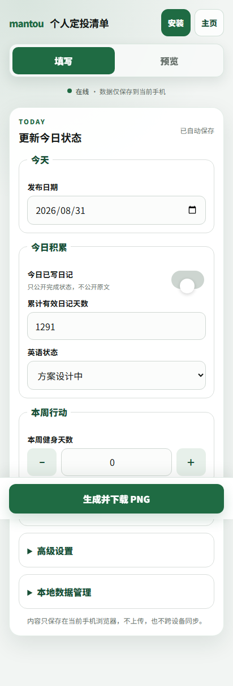
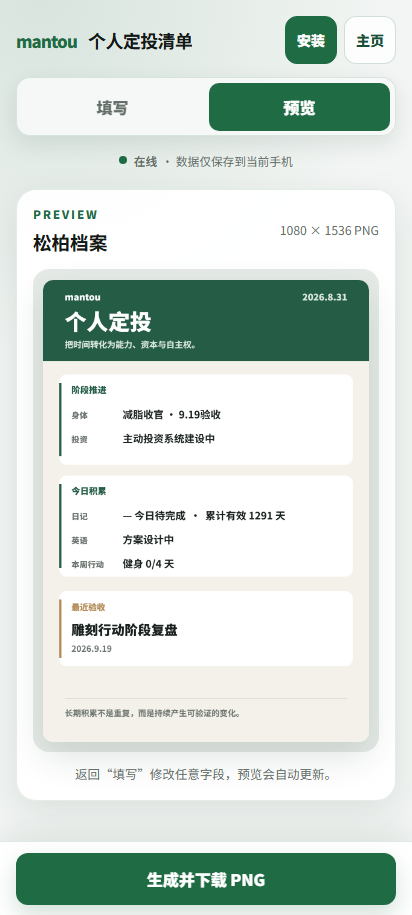

# mantou 个人定投清单

一个本地优先、可离线使用的个人长期行动清单生成器。它把每天需要公开的少量状态整理成一张 1080 × 1536 PNG，适合发布到微信群、社群或个人博客。

> 这里的“定投”不只指金钱，也指把时间持续投入认知、表达、身体与长期能力。

## 在线使用

- 主页生成器：<https://mantou-checklist.pages.dev/>
- 手机编辑器：<https://mantou-checklist.pages.dev/editor>

<p align="center">
  
  &nbsp;&nbsp;
  
</p>

## 它能做什么

- 填写日记完成状态、累计有效天数、英语状态和每周健身天数
- 记录当前身体阶段、投资阶段与最近验收成果
- 实时生成“松柏档案”风格图片
- 一键下载 1080 × 1536 PNG
- 自动保存到当前浏览器
- 首次联网安装后，可离线填写、预览和下载
- 导出 JSON 备份，并在另一台设备手动导入恢复
- 针对触控、窄屏和三星浏览器优化

## 三星手机安装

1. 用三星浏览器打开[手机编辑器](https://mantou-checklist.pages.dev/editor)。
2. 点击页面右上角的“安装”。如果没有弹出安装窗口，请在浏览器菜单中选择“添加页面到”或“安装应用”。
3. 从桌面图标启动一次，确认填写和预览正常。
4. 此后电脑关闭或手机暂时断网，编辑器仍可独立运行。

第一次加载和安装需要网络。升级到新版本时，也建议联网打开一次。

## 隐私与数据边界

这个项目没有后端数据库，也没有接入统计脚本。表单数据和自动保存内容默认只写入当前浏览器的 `localStorage`：

- 其他访问者无法看到你的本地清单
- 数据不会自动跨设备同步
- 清理浏览器数据、恢复出厂设置或删除站点数据可能导致记录丢失
- 不同域名之间的数据不会自动迁移

建议定期打开“本地数据管理”，下载 JSON 备份。不要在公开 Issue、聊天群或截图中上传包含私人信息的备份文件。

网站本身和源代码是公开的。请勿把日记原文、仓位、金额、账户总收益、API 密钥或其他秘密写入 `config.json`、HTML 或 JavaScript 文件。

## 本地运行

需要 Node.js 20+、Python 3，以及本机 Chrome（自动化测试使用）。

```powershell
git clone https://github.com/Maoxin1/mantou-checklist.git
cd mantou-checklist
npm install
npm run serve
```

打开：

- <http://127.0.0.1:4173/>
- <http://127.0.0.1:4173/editor.html>

常用命令：

```powershell
npm run check   # JavaScript 语法检查
npm run smoke   # 主页、手机、备份、离线和下载测试
npm run build   # 生成 Cloudflare Pages 发布目录 dist/
```

## 改成自己的版本

常用默认文案集中在 [`config.json`](./config.json)：

- `diaryDay`：累计有效日记天数起点
- `investmentPhase`：当前长期项目或专业阶段
- `englishStatus`：英语等候设计或完成状态
- `motto`：长期口号
- `beforeDeadline` / `afterDeadline`：阶段切换前后的默认内容

视觉颜色和手机布局位于 `styles.css`、`editor.css`；1080 × 1536 成图规则位于 `app.js` 的 Canvas 绘图函数中。

如果你公开部署自己的版本，请同步替换 `mantou` 品牌字样、默认目标和图标，避免让使用者误以为是同一个官方实例。

## Cloudflare Pages 部署

项目采用静态文件直接上传，不需要服务器或数据库：

```powershell
npm run build
npx wrangler login --device
npx wrangler pages project create your-project-name --production-branch main
npx wrangler pages deploy dist --project-name=your-project-name --branch=main
```

当前线上项目使用 Direct Upload；后续更新时重新运行构建和部署命令即可。

## 项目结构

```text
index.html / styles.css      桌面主页生成器
editor.html / editor.css    独立手机编辑器
app.js                      状态、保存、Canvas 成图与 PWA 安装
editor.js                   手机切换、离线提示和备份恢复
sw.js                       离线缓存
config.json                 可修改的默认文案
scripts/                    构建、截图与自动化测试
```

## 参与改进

欢迎提交 Issue 和 Pull Request。开始前请阅读 [`CONTRIBUTING.md`](./CONTRIBUTING.md)；安全问题请阅读 [`SECURITY.md`](./SECURITY.md)。

## 许可证

[MIT License](./LICENSE)。你可以使用、修改和再发布，但需要保留许可证和版权声明。
